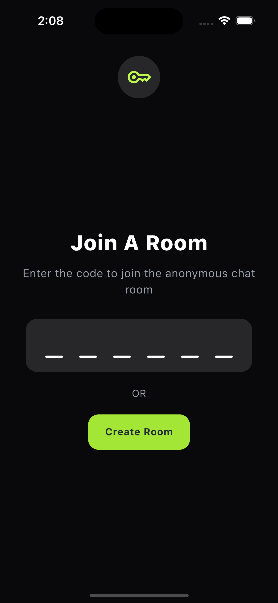
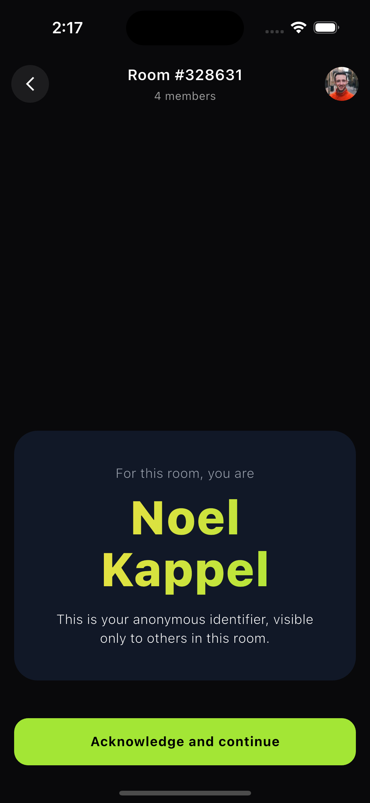
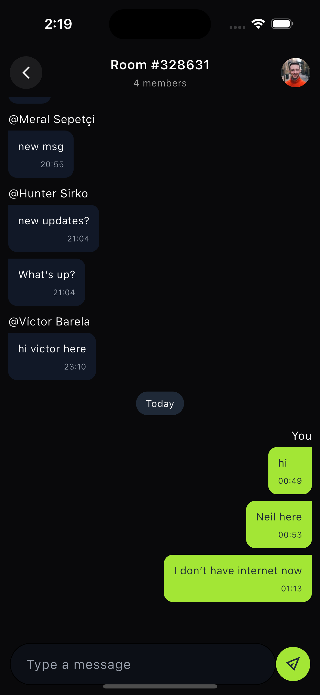
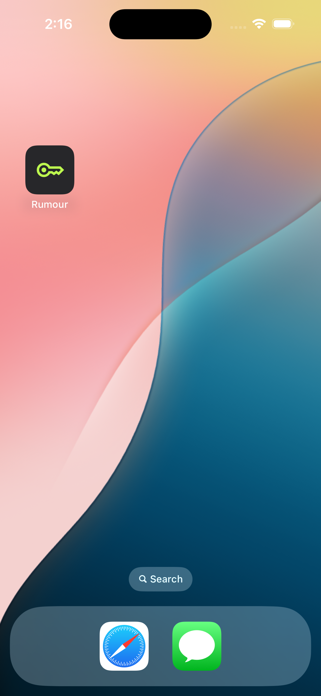

# 📱 Rumour — Anonymous Room-Code Chat App

A real-time anonymous chat application built using **Flutter** and **Firebase Cloud Firestore**, designed with an **offline-first architecture**, scalable state management, and pixel-perfect UI.

---

## 🚀 Overview

Rumour allows users to join chat rooms using a unique room code and participate in anonymous conversations. Each user is assigned a **random identity per room**, ensuring privacy while maintaining continuity across sessions.

---

## ✨ Features

### 🔐 Anonymous Identity

- Random user generated via `https://randomuser.me/api/`
- Identity persists locally per room using SharedPreferences
- Rejoining a room restores the same identity

---

### 💬 Real-Time Chat

- Powered by Firebase Cloud Firestore
- Instant updates using snapshot listeners
- Server timestamps for consistency

---

### 📜 Chat Experience

- Date separators (Today, Yesterday, etc.)
- Sender-based message alignment (left/right)
- Pagination for older messages
- Pagination loader for smooth UX

---

### 🌐 Offline-First Architecture

- Firestore offline persistence enabled
- Cached messages visible without internet
- Messages sent offline sync automatically when online

---

### 🏠 Room System

- Create new rooms
- Join existing rooms via code
- Room-based chat isolation

---

### 🛠️ Engineering Features (Added by Me )

- **Flavors-enabled Firebase setup**
    - Supports multiple environments (dev/prod)
    - Uses separate Firebase configurations for scalability and safer deployments

- **Clean Architecture**
    - Clear separation of layers: Presentation → State → Domain → Data
    - Improves maintainability, scalability, and testability

- **Theme Switching Ready**
    - Architecture prepared for light/dark mode support
    - Centralized theming system (`theme/` module)
    - Easy to extend for dynamic theme switching

---

## 📊 Architecture Overview

```text
UI (presentation/)
   ↓
State (Riverpod Notifiers)
   ↓
Repository (Domain abstraction)
   ↓
Source (Firestore / API / Local)
   ↓
External Systems
```

---

## 🧭 Architecture Diagram

```text
                        ┌────────────────────────────┐
                        │        UI LAYER            │
                        │ (Flutter Widgets / Pages)  │
                        └────────────┬───────────────┘
                                     │
                                     ▼
                        ┌────────────────────────────┐
                        │     STATE MANAGEMENT       │
                        │        (Riverpod)          │
                        └────────────┬───────────────┘
                                     │
                                     ▼
                        ┌────────────────────────────┐
                        │       REPOSITORY LAYER     │
                        └────────────┬───────────────┘
                                     │
                                     ▼
                        ┌────────────────────────────┐
                        │        DATA SOURCE         │
                        └────────────┬───────────────┘
                                     │
                ┌────────────────────┴────────────────────┐
                ▼                                         ▼
     Firebase Firestore                          External APIs
```

---

## 📂 Codebase Structure & Flow

Project structure (trimmed):

```text
lib/
├── core/
├── data/
├── domain/
├── presentation/
├── firebase/
├── main.dart
└── app.dart
```

---

### 🔹 Presentation Layer (`presentation/`)

Handles UI and user interaction.

- `chat/` → Chat UI (bubble, list, input)
- `home/` → Room join/create
- `shared/` → Reusable components
- `routes/` → Navigation

👉 Pure UI — no business logic

---

### 🔹 State Layer (Riverpod)

Located inside:

```
presentation/.../providers/
```

Handles:

- Chat state → `chat_notifier.dart`
- Room flow → `room_notifier.dart`
- User identity → `random_user_notifier.dart`

👉 Acts as bridge between UI and data layer

---

### 🔹 Domain Layer (`domain/`)

Contains:

- Pure models (Freezed)
- Repository contracts

Examples:

- `message_model.dart`
- `random_user_model.dart`
- `chat_repo.dart`

👉 No external dependencies

---

### 🔹 Data Layer (`data/`)

#### 📌 Repository

- Implements domain contracts
- Example: `chat_repo_impl.dart`

#### 📌 Source

- Firestore → `chat_source.dart`
- API → `random_user_source.dart`
- Local → `shar_pref.dart`

#### 📌 Helpers

- Timestamp conversion
- API setup
- SharedPref keys

---

### 🔹 Core Layer (`core/`)

Reusable infrastructure:

- Firestore service
- Connectivity providers
- Extensions & utilities
- Error handling

---

## 🔄 Chat Flow

```text
User sends message
   ↓
ChatInputWidget
   ↓
ChatNotifier
   ↓
ChatRepository
   ↓
ChatSource (Firestore)
   ↓
Firestore write
   ↓
snapshots() listener
   ↓
ChatNotifier (merge + sort)
   ↓
UI updates
```

---

## 🌐 Offline Flow

```text
Offline Mode
   ↓
Firestore Local Cache
   ↓
snapshots() listener
   ↓
ChatNotifier
   ↓
UI shows cached messages
```

---

## 🔥 Firebase Firestore Data Structure

```text
rooms (collection)
  └── {roomId}
        ├── lastMessage
        ├── lastMessageAt
        └── messages (subcollection)
              └── {messageId}
                    ├── text
                    ├── senderId
                    ├── senderName
                    ├── createdAt (serverTimestamp)
```

---

## 🧠 Identity Persistence Strategy

Stored per room:

```
room_user_<roomId> → RandomUserModel JSON
```

Ensures:

- Same identity on rejoin
- Different identity across rooms

---

## ⚡ Key Engineering Decisions

### ✅ Offline-First Design

- Avoided `get()` for chat
- Used `snapshots()` as single source of truth

---

### ✅ Message Deduplication

- Map-based merge using message IDs

---

### ✅ Pagination Handling

- Separate `isPaginating` state
- Loader shown correctly for reversed list

---

### ✅ Firestore Timestamp Handling

- Supports null timestamps (pending writes)
- Avoided filtering on `createdAt`

---

## 🎨 UI & Design

Pixel-perfect implementation based on Figma:

👉 https://www.figma.com/design/IkTeb75W5kNVQhv0vPh5mz/Rumour-App

---

## 📸 Screenshots

| Home                                | Confirmation page                         | Chat page                           |
| ----------------------------------- | ----------------------------------------- | ----------------------------------- |
|  |  |  |

| App Icon & name                        | Splash                                  |     |
| -------------------------------------- | --------------------------------------- | --- |
|  |  | !   |

---

## 📦 APK

👉 [Download APK](https://drive.google.com/file/d/1Vzt8dPNtMVyOf_UrTvEEoKIAuA4KixMl/view?usp=drive_link)

---

## 🎥 Demo Video

👉 [Watch Demo](https://drive.google.com/file/d/1c4aOw5GbQYabLfVvO2w5lsNN0ayFZO6H/view?usp=drive_link)

---

## 🛠️ Tech Stack

- Flutter
- Riverpod
- Firebase Cloud Firestore
- Freezed
- SharedPreferences

---

## 🧪 Run Project

```bash
flutter pub get
flutter run
```

---

## 📌 Final Summary

This project demonstrates:

- Clean architecture implementation
- Offline-first chat system
- Real-time data synchronization
- Scalable state management
- Production-level UI/UX

---
