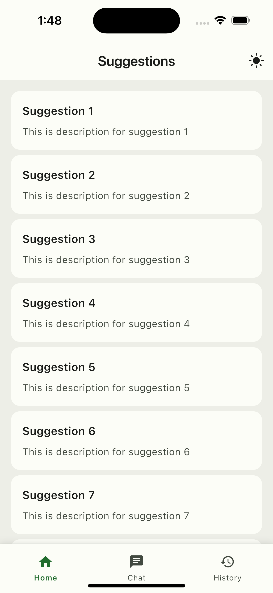
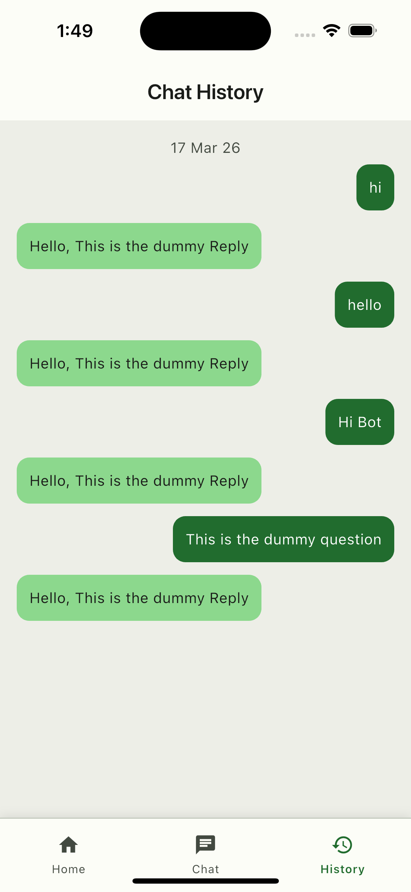
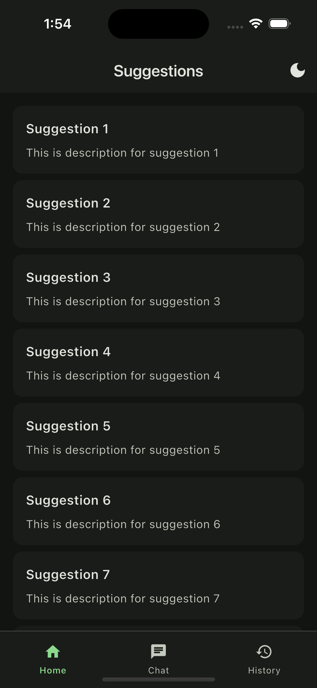
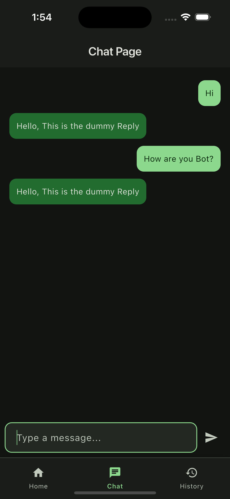
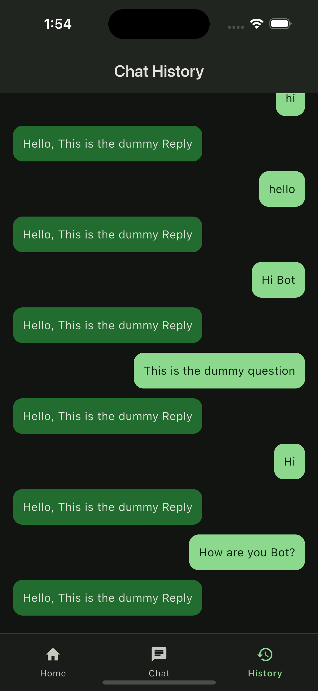
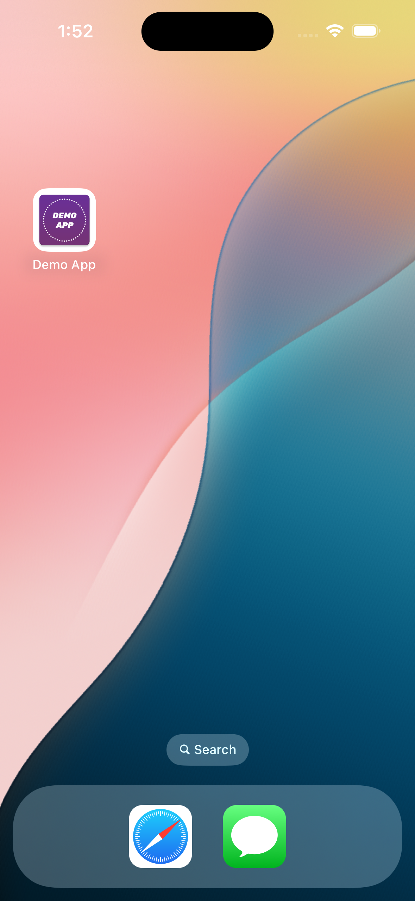
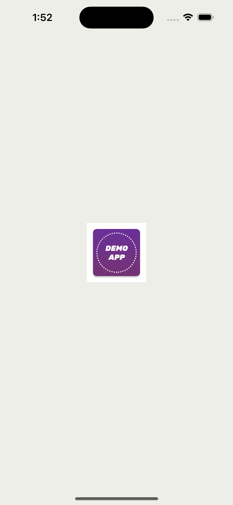

# 🚀 Flutter Demo App

A scalable Flutter application built using **Clean Architecture**, **Riverpod**, and **Material 3**, designed for maintainability, performance, and production readiness. ( Whole Demo app with no api calls but feels like real with all layers)

---

## ✨ Features

- Suggestion Page (Mocked Pagination list)
- Chat Page with real-time interaction
- Chat history with local persistence (using shared preference)
- Dark and light mode (toogle)

Other key insights:

- Used Riverpod for state management
- Used Clean Architecture for project structure
- Used Flavours for different environments
- Used Code gen packages (Freezed, Retrofit, FlutterGen)
- Used Material 3 for UI
- Used Good coding practices :)

---

## 📸 Screenshots

- Light Mode

| Home                           | Chat                           | History                              |
| ------------------------------ | ------------------------------ | ------------------------------------ |
|  |  |  |

- Dark Mode

| Home                                | Chat                                | History                                   |
| ----------------------------------- | ----------------------------------- | ----------------------------------------- |
|  |  |  |

| App Icon                           | Splash                           |     |
| ---------------------------------- | -------------------------------- | --- |
|  |  | !   |

---

## 🏗️ Architecture Overview

This project follows a **Clean Architecture + Feature-First structure** with **Riverpod** for state management.

```
lib/
 ├── core/           # App-wide utilities, constants, extensions
 ├── data/           # API + local data handling (sources, models, repo impl)
 ├── domain/         # Business logic (models + repository contracts)
 ├── presentation/   # UI + state management (Riverpod)
 ├── theme/          # App theming (Material 3)
 └── main.dart       # Entry point
```

---

## 🔁 Data Flow

```
UI (Widget)
   ↓
Notifier (Riverpod)
   ↓
Domain Repository (abstract)
   ↓
Repository Impl (data layer)
   ↓
Data Source (Remote / Local)
   ↓
API / Local Storage
```

---

## 🧩 Layer Breakdown

### 1️⃣ Presentation Layer (`presentation/`)

- UI Screens & Widgets
- State management using Riverpod
- Handles user interaction

**Example:**

```
chat/
 ├── chat_page.dart
 ├── chat_notifier.dart
 └── components/
```

---

### 2️⃣ Domain Layer (`domain/`)

- Business models
- Repository contracts (abstract classes)

**Key Principle:** No dependency on Flutter or external APIs

---

### 3️⃣ Data Layer (`data/`)

- API calls using Dio
- Local storage (SharedPreferences)
- Repository implementations

```
data/
 ├── source/
 │    ├── remote/
 │    └── local/
 ├── repository/
 └── model/
```

---

### 4️⃣ Core Layer (`core/`)

Reusable utilities across the app:

```
core/
 ├── constants/
 ├── extensions/
 ├── providers/
 ├── exceptions/
 └── utils/
```

Includes:

- Global providers (internet, token)
- Custom exceptions
- Extensions (BuildContext, Dio, etc.)

---

### 5️⃣ Shared Components (`presentation/shared/`)

Reusable UI components:

```
shared/components/
 ├── custom_filled_button.dart
 ├── custom_form_field.dart
 ├── loader_widget.dart
```

Ensures UI consistency and faster development.

---

### 6️⃣ Theming (`theme/`)

Material 3 based design system:

```
theme/
 ├── config/
 │    ├── app_theme.dart
 │    ├── color_schemes.dart
```

- Light & Dark mode support
- Centralized styling

---

## ⚙️ State Management

This project uses **Riverpod with code generation**.

- `Notifier` / `AsyncNotifier`
- `.g.dart` generated providers

**Example:**

```
chat_notifier.dart
chat_notifier.g.dart
```

### ✅ Benefits:

- Compile-time safety
- Scalable architecture
- Clear separation of concerns

---

## 🌐 Networking

- Built with **Dio**
- Custom interceptors:
    - Token interceptor
    - Error interceptor
    - Logging interceptor

**Location:**

```
data/helper/
```

---

## 💾 Local Storage

- SharedPreferences abstraction
- Chat history stored locally

```
data/source/local/
```

---

## 🚀 Getting Started

### 1. Clone the repository

```
git clone https://github.com/Krishnachoudhary619/demo-chat-app.git
```

### 2. Install dependencies

```
flutter pub get
```

### 3. Generate code

```
flutter pub run build_runner build --delete-conflicting-outputs
```

### 4. Run the app

```
flutter run
```

---

## 🧠 Why This Architecture?

- 🔹 Clear separation of concerns
- 🔹 Scalable for large applications
- 🔹 Easy to maintain and test
- 🔹 Feature-based modular structure
- 🔹 Strong integration with Riverpod

---
